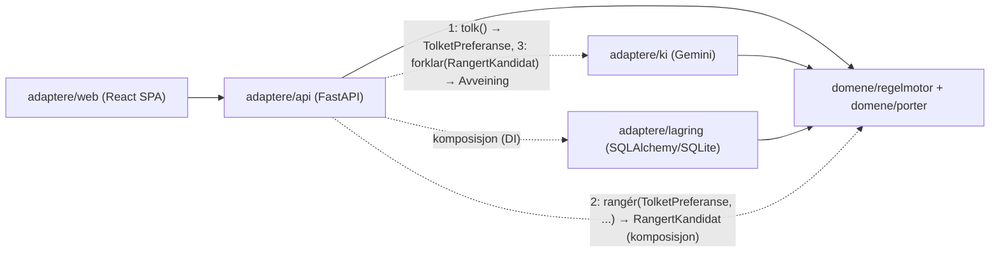
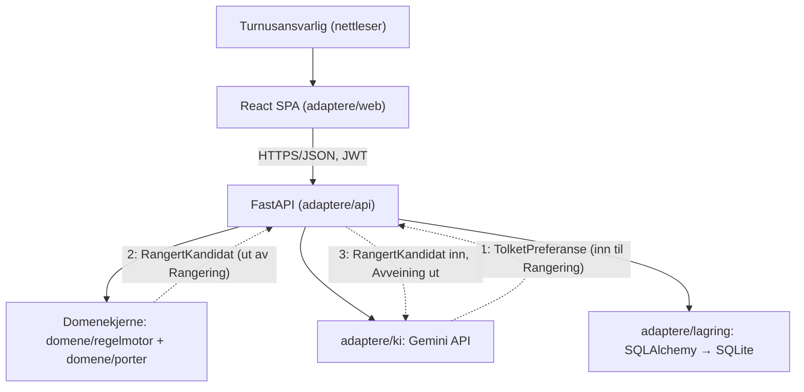
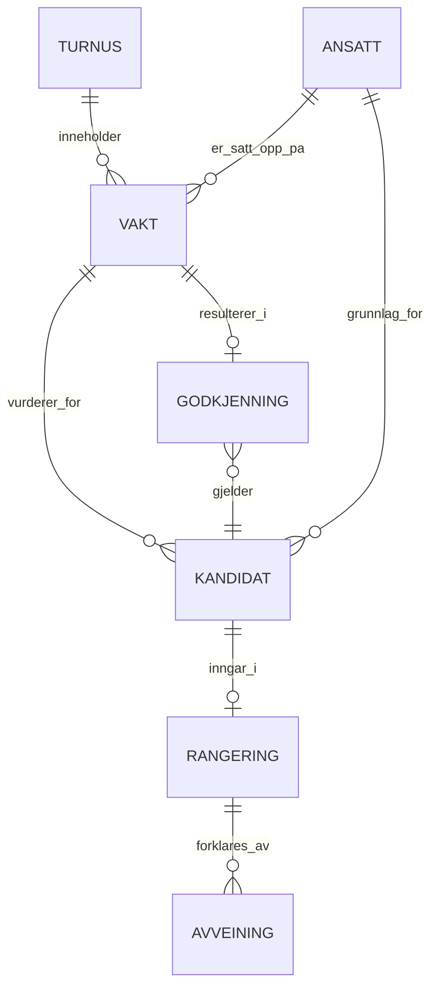

# Architecture Spine — Turnushjelperen

## Design Paradigm

Hexagonal (Ports & Adapters), lett utgave. Domenekjernen er regelmotoren — ren Python, ingen avhengighet til rammeverk eller KI. To eksplisitte typede grensesnitt (Pydantic-modellene `TolketPreferanse` og `RangertKandidat`), begge eid av `domene/porter`, er de eneste kontaktflatene mellom domenekjernen og KI-adapteren; alt annet er adaptere som avhenger av kjernen, aldri omvendt.

KI-adapteren har to atskilte, ensrettede roller — den kaller aldri inn i domenekjernen i noen av dem:
1. **Tolker** (før Rangering): `adaptere/ki` tar imot rå Ansattpreferanse-tekst og returnerer en `TolketPreferanse` — `adaptere/api` sender denne videre inn i `domene/regelmotor` som ordinær input, på linje med Kompetansenivå og Vakt-data (FR-10).
2. **Forklarer** (etter Rangering): `adaptere/ki` tar imot en ferdig `RangertKandidat` og returnerer Avveining-teksten (FR-11).

Domenekjernen kaller aldri `adaptere/ki` selv i noen av retningene — `adaptere/api` orkestrerer begge kallene og sender resultatet inn/ut av `domene/regelmotor` som vanlige funksjonsargumenter/-returverdier.

| Lag | Modul | Rolle |
| --- | --- | --- |
| Domenekjerne | `domene/regelmotor` | Harde regler (kompetanse-minstekrav, kolliderende vakt, 11-timersregelen, 35-timersregelen), kostnadsberegning, Rangering (tar `TolketPreferanse` som input, produserer `RangertKandidat`). Ren Python, null avhengighet til KI eller rammeverk. |
| Domenekjerne | `domene/porter` | Typede grensesnitt (Pydantic-modeller: `TolketPreferanse` inn til Rangering, `RangertKandidat` ut av Rangering) — eneste kontaktflate mot driven adapters. |
| Driven adapter | `adaptere/ki` | Gemini-integrasjon. To ensrettede funksjoner: tolker Ansattpreferanse-tekst → `TolketPreferanse`, og genererer Avveining fra `RangertKandidat`. Ser og produserer kun det portene definerer. |
| Driven adapter | `adaptere/lagring` | SQLAlchemy/SQLite. Persisterer Turnus, Vakt, Ansatt, Godkjenning og innloggingssesjon. |
| Driving adapter | `adaptere/api` | FastAPI-endepunkter. Komponerer/kobler sammen domenekjerne og driven adapters (KI, lagring). |
| Driving adapter | `adaptere/web` | React-SPA. Snakker kun med `adaptere/api` over HTTP. |

## Invariants & Rules

### AD-1 — Domenekjerne og KI-adapter er strukturelt atskilt

- **Binds:** hele kandidat-rangerings- og forklaringsflyten (§4.2–§4.5, FR-2 til FR-11)
- **Prevents:** at KI-adapteren beregner eller overstyrer Harde regler, kostnad eller Rangering, eller får se en Kandidat som er utelukket av en Hard regel — dette er PRD SM-2 sin testbare invariant. Forhindrer også at Rangeringen slutter å være reproduserbar (SM-5) fordi en språkmodell tolker den samme preferanseteksten ulikt fra kall til kall.
- **Rule:** `domene/regelmotor` og `domene/porter` har ingen importer av `adaptere/ki`, verken direkte eller transitivt, i noen retning — håndheves statisk med et import-linter-kontrakt. `adaptere/ki` kalles aldri av domenekjernen; `adaptere/api` orkestrerer begge retningene (se Design Paradigm):
  1. **Inn i Rangering:** `adaptere/ki` tolker rå Ansattpreferanse-tekst til en `TolketPreferanse`. Denne tolkningen skjer **én gang per Ansatt/preferansetekst og caches/persisteres** av `adaptere/lagring` — `domene/regelmotor` mottar alltid en allerede tolket, lagret verdi, aldri et rått KI-kall live under selve rangeringsberegningen. Dette er det som gjør SM-5 mulig til tross for at tolkningssteget i seg selv bruker en språkmodell.
  2. **Ut av Rangering:** `adaptere/ki` mottar utelukkende data formet som porten `RangertKandidat` (kun Gyldige kandidater, kun de feltene domenekjernen har regnet ut) og kan aldri kalle inn i `domene/regelmotor` for å hente mer.
  En statisk importsjekk alene stopper ikke en kjøretidslekkasje i retning 2 (f.eks. at `adaptere/api` ved en feil sender en utelukket Kandidat inn i porten uten å bryte noen import-regel) — derfor kreves i tillegg en kjøretidsinvariant-test i `tester/` som, for et testscenario med kjente utelukkelser, verifiserer at *ingen* av ID-ene i listen `adaptere/api` faktisk sender til `adaptere/ki` finnes blant de utelukkede ID-ene fra `domene/regelmotor` sin fulle kjøring. Begge portene (`TolketPreferanse`, `RangertKandidat`, og en tilhørende `UtelukkelsesOppsummering`-port for Ekskludert-boksen, EXPERIENCE.md § Component Patterns) er eid av `domene/porter`; kun `domene/regelmotor` konstruerer `RangertKandidat` og `UtelukkelsesOppsummering`, kun `adaptere/ki` konstruerer `TolketPreferanse`. Minimumsfelt på `RangertKandidat`: kandidat-referanse (id/navn), Kompetansenivå, kostnadstype + beløp, arbeidsbelastning (timer + prosent av terskel), rangeringsplass, den tilhørende `TolketPreferanse` (til bruk i forklaringen — ikke rå tekst på dette steget).

### AD-2 — Avhengighetsretning gjelder alle adaptere

- **Binds:** all (`adaptere/api`, `adaptere/web`, `adaptere/ki`, `adaptere/lagring`)
- **Prevents:** at en adapter blir en skjult avhengighet inne i domenekjernen, slik at domenekjernen slutter å være kjørbar og testbar helt uten rammeverk, database eller nettverk.
- **Rule:** Adaptere avhenger av `domene/*`, aldri omvendt. Komposisjon (hvilken konkret adapter som kobles inn hvor, f.eks. hvilken KI-adapter eller lagringsadapter) skjer i `adaptere/api` sitt oppstartslag, ikke i domenekjernen. Samme mekaniske håndhevelse som i AD-1 (import-linter-kontrakt) gjelder for *alle* fire adaptere, ikke bare `adaptere/ki` — `domene/regelmotor` og `domene/porter` skal ha null importer fra noen `adaptere/*`-pakke.



### AD-3 — Sesjon/autentisering representeres som ett JWT

- **Binds:** FR-13 og all funksjonalitet bak innlogging (§4.1–§4.6), grensesnittet mellom `adaptere/api` og `adaptere/web`
- **Prevents:** at frontend og backend bygger ulike, uforenlige antakelser om hva «innlogget» betyr (f.eks. cookie ett sted og header et annet, eller ulikt token-innhold).
- **Rule:** `adaptere/api` utsteder ett JWT ved vellykket innlogging. `adaptere/web` lagrer det i en `httpOnly`-cookie (ikke `localStorage` — reduserer XSS-eksponering) og sender det automatisk på alle etterfølgende kall. Passordhashing eies alene av `adaptere/lagring` — `adaptere/api` sender aldri passord videre i klartekst utover selve innloggingskallet, og lagrer aldri et hash-resultat selv. Ingen stille token-fornyelse i v1: JWT-et utløper, og Turnusansvarlig må logge inn på nytt (enklest for et prosjekt av denne størrelsen). Nøyaktig utløpstid er ikke fastsatt — se Deferred.

### AD-4 — Én feilresponsform i API-et

- **Binds:** alle responser fra `adaptere/api` mot `adaptere/web`
- **Prevents:** at frontend må spesialhåndtere ulike feilformer per endepunkt, og at «ingen gyldige kandidater» (FR-6) forveksles med en teknisk feil eller lastetilstand — et eksplisitt UX-krav (EXPERIENCE.md § State Patterns).
- **Rule:** Alle faktiske feilresponser fra `adaptere/api` følger samme strukturerte envelope: `{ "kode": string, "melding": string }` (maskinlesbar feilkode + menneskelesbar melding for utviklere/logger — **ikke** ferdig brukertekst). `melding` vises aldri verbatim i `adaptere/web`; frontend slår opp `kode` mot sin egen tekstliste og viser en tone-riktig norsk melding derfra (jf. EXPERIENCE.md § Voice and Tone — «systemet beskriver tilstand, formaner aldri»), slik at rå backend-tekst aldri lekker til brukergrensesnittet. «Ingen gyldige kandidater» (FR-6) og «Avveining feilet/tom» (FR-11, inkludert når `adaptere/ki` rammes av Geminis fartsgrense) er ikke HTTP-feil — de er gyldige 200-svar med en eksplisitt `status`-diskriminator (f.eks. `"ok" | "ingen_gyldige_kandidater" | "avveining_feilet"`) i responsen, nettopp for å holdes atskilt fra faktiske feiltilstander og fra hverandre; samme regel gjelder disse — `adaptere/web` styrer teksten ut fra `status`, ikke et fritekstfelt fra API-et. Eksakte feilkode-verdier og fullt responsskjema per endepunkt er ikke fastsatt — se Deferred.

### AD-5 — Lagringsadapteren eier databaseskjemaet

- **Binds:** Godkjenning (FR-12), Innlogging (FR-13), `adaptere/lagring`
- **Prevents:** at domenekjernen eller API-adapteren utvikler sin egen, avvikende oppfatning av databasetabellene slik at skjemaet drifter.
- **Rule:** `adaptere/lagring` eier SQLAlchemy-modellene og databaseskjemaet alene. `domene/regelmotor` kjenner kun sine egne rene Python/Pydantic-typer (Vakt, Kandidat, osv.) og aldri SQLAlchemy-modeller. Konvertering mellom lagringsmodell og domenetype skjer i `adaptere/lagring`. Enhver endring av Vakt-/Turnus-tilstand (at en vakt regnes som bemannet) skjer utelukkende gjennom `adaptere/lagring` sin ene skrivefunksjon for Godkjenning, som krever et fullstendig Godkjenning-objekt som argument — det finnes ingen annen kodevei som kan skrive denne tilstanden, verken fra `adaptere/api` direkte eller fra domenekjernen. Migreringsverktøy er ikke valgt — se Deferred.

## Consistency Conventions

| Concern | Convention |
| --- | --- |
| Naming (entities, files, interfaces, events) | Domenebegreper bruker PRD §3 sine termer presist, også i kode der det er treffende (Kandidat, Gyldig kandidat, Hard regel, Kompetansenivå, Rangering, Avveining, Godkjenning), jf. AGENTS.md om norsk dokumentasjon/engelsk der det er mer presist. Modulnavn følger Design Paradigm-tabellen (`domene/regelmotor`, `domene/porter`, `adaptere/api`, `adaptere/ki`, `adaptere/lagring`, `adaptere/web`) — engelske fellesbegreper som «adapter»/«port» beholdes på engelsk. |
| Data & formats (ids, dates, error shapes, envelopes) | Feilresponsform og statusdiskriminator: se AD-4. Datoer/klokkeslett i API-kontrakten: ISO 8601. Tidssone: alle Vakt-tidspunkt lagres og beregnes i `Europe/Oslo` (DST-bevisst, ikke fast UTC-offset) — én autoritativ tidssone på tvers av domenekjerne og lagring, avgjørende for at 11-timers-/35-timersregelen (FR-4, FR-5) gir samme resultat for samme input hver gang (SM-1, SM-5), særlig rundt sommertid-overganger. Identifikatorer tildeles og eies av `adaptere/lagring` (SQLAlchemy primærnøkler); konkret ID-format (int vs. UUID) er en implementasjonsdetalj, ikke fastsatt her. |
| State & cross-cutting (mutation, errors, logging, config, auth) | Auth/sesjon: se AD-3. Ingen mutasjon av Turnus-/Vakt-tilstand uten eksplisitt Godkjenning (FR-12) — håndheves i `adaptere/api`, aldri i frontend alene. Config: API-nøkler (f.eks. Gemini) og hemmeligheter (f.eks. JWT-signeringsnøkkel) leses kun fra miljøvariabler, aldri hardkodet; nye variabler dokumenteres udokumentert (uten verdier) i `.env.example`, iht. AGENTS.md. Runtime-driftslogging er ikke besluttet — se Deferred. KI-genereringslogg (separat fra runtime-logging, en dokumentasjonskonvensjon, ikke arkitektur): AI-generert kode logges i `docs/ki-logg/<dato>-<tema>.md`, iht. AGENTS.md. |
| Testing (kvalitetssikringsbevis) | pytest på backend. Ett testmodul per hard regel i regelmotoren (kompetanse-minstekrav, kolliderende vakt, 11-timersregelen, 35-timersregelen) — konvensjon, ikke bare praksis, og den konkrete mekanismen som håndhever AD-1/AD-2 sine grenser (f.eks. en test som feiler dersom `domene/regelmotor` importerer `adaptere/ki`). |

## Stack

| Name | Version |
| --- | --- |
| FastAPI (Python) | 0.141.1 (verifisert 2026-09-29) |
| React | 19.3.0 |
| Vite | 8.3.1 |
| TypeScript | 7.0.2 (verifisert 2026-09-29; native Go-kompilator, avløste 5.x/6.x-linjen) |
| SQLite (via SQLAlchemy) | Ikke versjonsfestet — se Deferred |
| Google Gemini API | Ikke versjonsfestet (kun leverandør valgt). Gratis-tier er modellavhengig og strammet inn i 2026 (nyere Flash-modeller: færre gratis kall/dag enn eldre; Pro-modeller krever betaling siden april 2026) — verifiser faktisk grense for den konkrete modellen når den velges. Se Deferred. |

## Structural Seed

### System-/containeroversikt



**Kjøremiljø:** kun lokal kjøring for nå (ingen hosting besluttet). Se Deferred.

### Kjernedomene (ERD — navn og relasjoner, ingen detaljerte felter)



Gyldig kandidat, Hard regel og Kompetansenivå er ikke egne entiteter her — Gyldig kandidat er en beregnet tilstand på Kandidat (filtrert av Hard regel, se AD-1), og Kompetansenivå er et attributt på Ansatt/Kandidat som både inngår i filtreringen (Hard regel) og i Rangeringen (Myk faktor), jf. PRD §3. Tolket preferanse (se AD-1) er heller ikke egen entitet i dette diagrammet, men lagres av `adaptere/lagring` knyttet til Ansatt — den er inputet Rangering leser, ikke et resultat av den.

Avveining er **ikke** en varig lagret entitet til tross for at diagrammet viser den koblet til Rangering — den genereres av `adaptere/ki` hver gang en Rangering vises, og persisteres ikke separat. Kun selve Godkjenningen (hvem, hvilken Vakt, når) lagres varig i `adaptere/lagring`; en tidligere vist Avveining kan derfor i prinsippet avvike noe fra en senere regenerert Avveining for samme Kandidat dersom underliggende data (f.eks. arbeidsbelastning) har endret seg mellom to visninger — se Deferred for hvorvidt dette bør låses fast ved Godkjenning.

### Minimal kildetre

```text
turnushjelperen/
  backend/
    domene/
      regelmotor/      # harde regler, kostnadsberegning, rangering — domenekjerne
      porter/          # typede grensesnitt (Pydantic), f.eks. RangertKandidat
    adaptere/
      api/             # FastAPI-endepunkter (driving adapter)
      ki/               # Gemini-integrasjon (driven adapter, ser kun porten)
      lagring/          # SQLAlchemy/SQLite-repository (driven adapter)
    tester/
      regelmotor/       # ett testmodul per hard regel
  frontend/
    src/                # React SPA (driving adapter, kun HTTP mot adaptere/api)
  docs/
    ki-logg/            # KI-genereringslogg, iht. AGENTS.md
  .env.example           # navngitte, udokumenterte miljøvariabler, iht. AGENTS.md
```

## Capability → Architecture Map

| Capability / Area | Lives in | Governed by |
| --- | --- | --- |
| §4.1 Vaktvalg (FR-1) | `adaptere/api`, `adaptere/web` | Design Paradigm, IA i EXPERIENCE.md |
| §4.2 Regelmotor / harde regler (FR-2–FR-6) | `domene/regelmotor` | AD-1, AD-2, Testing-raden i Consistency Conventions |
| §4.3 Kostnad og arbeidsbelastning (FR-7–FR-8) | `domene/regelmotor` | AD-1, AD-2 (reproduserbart, uavhengig av KI) |
| §4.4 Rangering (FR-9) | `domene/regelmotor` | AD-1, AD-2 |
| §4.5 KI-tolkning av preferanser og Avveining (FR-10–FR-11) | `adaptere/ki` (begge retninger), `domene/regelmotor` (konsumerer `TolketPreferanse`) | AD-1 (den harde systemgrensen og de to portene), config-raden i Consistency Conventions (Gemini-nøkkel) |
| §4.6 Godkjenning av erstatter (FR-12) | `adaptere/api`, `adaptere/lagring` | AD-4 (feilform), AD-5 (skjemaeierskap), State-raden (ingen mutasjon uten Godkjenning) |
| §4.7 Innlogging (FR-13) | `adaptere/api`, `adaptere/lagring` | AD-3 (JWT/sesjon) |

## Deferred

- **Vekting mellom Myke faktorer i Rangeringen** (PRD §8, spørsmål 2) — gruppen har bekreftet at kompetansenærhet skal telle tungt når ingen Kandidat er fullt kvalifisert, men fullstendig vekting for øvrig er ikke avklart. Avklares av gruppen før implementasjon av `domene/regelmotor`.
- **Konkret detaljnivå i kostnadsmodellen** (PRD §8, spørsmål 3; FR-7) — nøyaktige satser og betingelser som skiller ordinær kostnad fra overtidskostnad er ikke fastsatt.
- **Ordlyd for «ingen gyldige kandidater», «innlogging feilet» og «beregner rangering»** (EXPERIENCE.md § State Patterns, merket `[ASSUMPTION]`) — atferden er spesifisert (skal skille seg tydelig fra feil/lastetilstand), men eksakt tekst er åpen.
- **Responsive breakpoints** (DESIGN.md/EXPERIENCE.md § Responsive & Platform, merket `[ASSUMPTION]`) — kun én fast desktop-bredde (1180px) er vist i mockupene; stablingsmønster for mobil/nettbrett er foreslått, ikke bekreftet.
- **Hosting/driftsmiljø** — kun lokal kjøring er besluttet. Render sin gratis-tier er nevnt som en mulig senere utvidelse (sovner etter 15 min inaktivitet, ca. 1 min kaldstart), men ikke valgt.
- **Gemini modellversjon og retry/backoff-policy ved fartsgrense** — kun leverandør (Google Gemini API) er valgt, ikke en spesifikk modell. AD-4 sikrer at en fartsgrense-feil vises som «Avveining feilet» og ikke krasjer noe, men selve retry-/backoff-strategien i `adaptere/ki` (f.eks. antall forsøk, ventetid) er ikke besluttet.
- **JWT utløpstid** (AD-3) — representasjonsform (httpOnly-cookie, ingen stille fornyelse i v1) er besluttet; nøyaktig utløpstid er ikke.
- **SQLite-skjema/migreringsverktøy** (AD-5) — f.eks. Alembic vs. håndrullet migrering er ikke valgt. Samme gjelder eksakt SQLAlchemy-versjon (se Stack) og ID-format (int vs. UUID, se Consistency Conventions).
- **Feilenvelope-detaljer** (AD-4) — envelope-form og statusdiskriminator er besluttet; eksakte feilkode-verdier og fullt responsskjema per endepunkt er ikke.
- **Om Avveining bør låses ved Godkjenning** — i dag regenereres den alltid (se ERD-notatet); om Godkjenning bør fryse/lagre teksten som ble vist da valget ble tatt (for etterprøvbarhet) er ikke avgjort.
- **Transport for progressiv lasting av Avveining** (EXPERIENCE.md § State Patterns, «Beregner rangering», merket `[ASSUMPTION]`) — at rader vises før KI-forklaringen er ferdig er foreslått, men om dette løses med streaming, polling, eller flere separate kall er ikke besluttet.
- **Runtime-/driftslogging** — ikke besluttet (skilt fra den allerede bindende KI-genereringsloggen i `docs/ki-logg/`, se Consistency Conventions).
